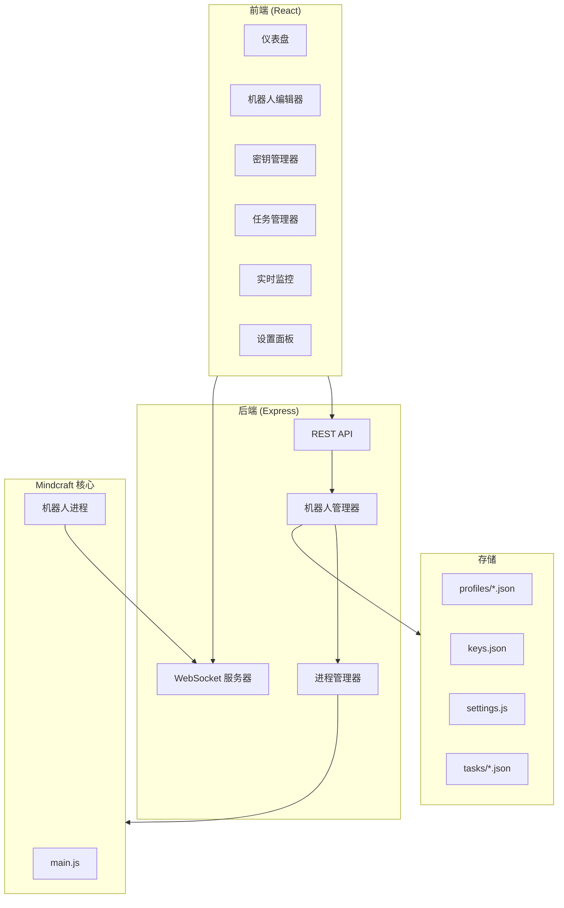

# 设计文档

## 概述

Mindcraft 可视化管理平台是一个基于 Web 的应用程序，用于管理和监控 Mindcraft Minecraft AI 机器人。该平台采用前后端分离架构，前端使用 React + TypeScript，后端使用 Node.js + Express，通过 WebSocket 实现实时通信。

### 技术栈

- **前端**: React 18 + TypeScript + Vite + TailwindCSS
- **后端**: Node.js + Express + TypeScript
- **实时通信**: Socket.IO
- **状态管理**: Zustand
- **数据存储**: 文件系统 (JSON 文件)
- **图标库**: Lucide React (简洁线性图标)
- **UI 组件**: shadcn/ui (现代化组件库)

### UI 设计规范

#### 设计原则

1. **简洁现代**: 采用扁平化设计，避免过度装饰
2. **专业克制**: 不使用 emoji，使用专业的 SVG 图标
3. **一致性**: 统一的间距、圆角、阴影系统
4. **可访问性**: 符合 WCAG 2.1 AA 标准

#### 视觉规范

```typescript
// 颜色系统 - 以白色为主的简洁配色
const colors = {
  // 背景色 - 白色系
  background: {
    primary: '#ffffff',      // 主背景
    secondary: '#f9fafb',    // 次级背景/卡片
    tertiary: '#f3f4f6',     // 第三级背景
  },
  // 强调色 - 低饱和度灰蓝
  accent: {
    light: '#e0e7ff',
    DEFAULT: '#6366f1',      // 主强调色 (indigo)
    dark: '#4f46e5',
  },
  // 文字色
  text: {
    primary: '#111827',      // 主文字
    secondary: '#6b7280',    // 次级文字
    muted: '#9ca3af',        // 弱化文字
  },
  // 边框色
  border: {
    light: '#f3f4f6',
    DEFAULT: '#e5e7eb',
    dark: '#d1d5db',
  },
  // 状态色
  status: {
    online: '#10b981',       // 在线 - 绿色
    offline: '#9ca3af',      // 离线 - 灰色
    error: '#ef4444',        // 错误 - 红色
    warning: '#f59e0b',      // 警告 - 橙色
  },
};

// 间距系统 (基于 4px)
const spacing = {
  xs: '4px',
  sm: '8px',
  md: '16px',
  lg: '24px',
  xl: '32px',
};

// 圆角系统
const borderRadius = {
  sm: '4px',
  md: '8px',
  lg: '12px',
  full: '9999px',
};

// 阴影系统 - 轻柔阴影
const shadows = {
  sm: '0 1px 2px rgba(0, 0, 0, 0.03)',
  md: '0 4px 6px rgba(0, 0, 0, 0.04)',
  lg: '0 10px 15px rgba(0, 0, 0, 0.05)',
};
```

#### 组件样式

1. **卡片**: 纯白背景，浅灰细边框，轻柔阴影，8px 圆角
2. **按钮**: 主按钮使用 accent 色，hover 时加深；次要按钮使用白底 + 边框
3. **输入框**: 白色背景，浅灰边框，focus 时显示 accent 色环
4. **状态指示器**: 使用小圆点 + 文字，不使用 emoji
5. **图标**: 使用 Lucide 图标，统一 20px 大小，stroke-width 1.5，颜色使用 text-secondary

#### 布局规范

```
┌─────────────────────────────────────────────────────────┐
│  Logo    导航菜单                          用户/设置    │  <- 顶部导航 64px (白色背景)
├─────────────────────────────────────────────────────────┤
│         │                                               │
│  侧边栏  │              主内容区域                       │  <- 浅灰背景 (#f9fafb)
│  240px  │              (白色卡片)                        │
│ (白色)  │                                               │
└─────────────────────────────────────────────────────────┘
```

## 架构



## 组件和接口

### 前端组件

#### 1. Dashboard 组件
```typescript
interface DashboardProps {
  bots: BotProfile[];
  onBotSelect: (botId: string) => void;
  onBotStart: (botId: string) => void;
  onBotStop: (botId: string) => void;
}

interface BotCardProps {
  bot: BotProfile;
  status: BotStatus;
  onClick: () => void;
  onStart: () => void;
  onStop: () => void;
}
```

#### 2. BotEditor 组件
```typescript
interface BotEditorProps {
  bot?: BotProfile;
  onSave: (bot: BotProfile) => void;
  onCancel: () => void;
}

interface ModelConfigProps {
  model: ModelConfig;
  onChange: (model: ModelConfig) => void;
  providers: LLMProvider[];
}
```

#### 3. KeyManager 组件
```typescript
interface KeyManagerProps {
  keys: APIKeys;
  onUpdate: (provider: string, key: string) => void;
  onDelete: (provider: string) => void;
}
```

#### 4. TaskManager 组件
```typescript
interface TaskManagerProps {
  tasks: Task[];
  onTaskCreate: (task: Task) => void;
  onTaskStart: (taskId: string, botId: string) => void;
  onTaskDelete: (taskId: string) => void;
}
```

#### 5. Monitor 组件
```typescript
interface MonitorProps {
  botId: string;
  logs: LogEntry[];
  position: Position;
  inventory: InventoryItem[];
}
```

### 后端 API 接口

#### REST API 端点

```typescript
// 机器人配置 API
GET    /api/bots              // 获取所有机器人配置
GET    /api/bots/:id          // 获取单个机器人配置
POST   /api/bots              // 创建机器人配置
PUT    /api/bots/:id          // 更新机器人配置
DELETE /api/bots/:id          // 删除机器人配置

// API 密钥 API
GET    /api/keys              // 获取所有 API 密钥状态（不返回实际密钥）
PUT    /api/keys/:provider    // 更新指定提供商的 API 密钥
DELETE /api/keys/:provider    // 删除指定提供商的 API 密钥

// 设置 API
GET    /api/settings          // 获取服务器设置
PUT    /api/settings          // 更新服务器设置

// 任务 API
GET    /api/tasks             // 获取所有任务
POST   /api/tasks             // 创建任务
DELETE /api/tasks/:id         // 删除任务

// 机器人控制 API
POST   /api/bots/:id/start    // 启动机器人
POST   /api/bots/:id/stop     // 停止机器人
GET    /api/bots/:id/status   // 获取机器人状态

// 配置导入导出 API
GET    /api/export            // 导出所有配置
POST   /api/import            // 导入配置
```

#### WebSocket 事件

```typescript
// 服务器 -> 客户端
interface ServerEvents {
  'bot:status': (data: { botId: string; status: BotStatus }) => void;
  'bot:log': (data: { botId: string; log: LogEntry }) => void;
  'bot:position': (data: { botId: string; position: Position }) => void;
  'bot:inventory': (data: { botId: string; inventory: InventoryItem[] }) => void;
  'bot:error': (data: { botId: string; error: string }) => void;
}

// 客户端 -> 服务器
interface ClientEvents {
  'subscribe': (botId: string) => void;
  'unsubscribe': (botId: string) => void;
}
```

## 数据模型

### BotProfile (机器人配置)
```typescript
interface BotProfile {
  id: string;                    // 唯一标识符
  name: string;                  // 机器人名称
  model: ModelConfig;            // 主模型配置
  codeModel?: ModelConfig;       // 代码生成模型
  visionModel?: ModelConfig;     // 视觉模型
  embedding?: EmbeddingConfig;   // 嵌入模型
  speakModel?: string;           // 语音合成模型
  conversing: string;            // 对话提示词
  coding: string;                // 编码提示词
  saving_memory: string;         // 记忆保存提示词
  modes: BotModes;               // 机器人模式配置
}

interface ModelConfig {
  api: string;                   // API 提供商
  model: string;                 // 模型名称
  url?: string;                  // 自定义 API URL
  params?: Record<string, any>;  // 额外参数
}

interface EmbeddingConfig {
  api: string;
  model: string;
  url?: string;
}

interface BotModes {
  self_preservation: boolean;
  unstuck: boolean;
  cowardice: boolean;
  self_defense: boolean;
  hunting: boolean;
  item_collecting: boolean;
  torch_placing: boolean;
  idle_staring: boolean;
  cheat: boolean;
}
```

### APIKeys (API 密钥)
```typescript
interface APIKeys {
  OPENAI_API_KEY?: string;
  GEMINI_API_KEY?: string;
  ANTHROPIC_API_KEY?: string;
  XAI_API_KEY?: string;
  DEEPSEEK_API_KEY?: string;
  QWEN_API_KEY?: string;
  MISTRAL_API_KEY?: string;
  REPLICATE_API_KEY?: string;
  GROQCLOUD_API_KEY?: string;
  HUGGINGFACE_API_KEY?: string;
  NOVITA_API_KEY?: string;
  OPENROUTER_API_KEY?: string;
  GHLF_API_KEY?: string;
  HYPERBOLIC_API_KEY?: string;
  CEREBRAS_API_KEY?: string;
  MERCURY_API_KEY?: string;
}
```

### ServerSettings (服务器设置)
```typescript
interface ServerSettings {
  host: string;                  // Minecraft 服务器地址
  port: number;                  // 服务器端口
  auth: 'offline' | 'microsoft'; // 认证模式
  version: string;               // Minecraft 版本
  allowInsecureCoding: boolean;  // 是否允许不安全代码执行
}
```

### Task (任务)
```typescript
interface Task {
  id: string;                    // 任务 ID
  name: string;                  // 任务名称
  goal: string;                  // 任务目标描述
  target: string;                // 目标物品
  numberOfTarget: number;        // 目标数量
  timeout: number;               // 超时时间（秒）
  agentCount: number;            // 代理数量
  initialInventory: Record<string, Record<string, number>>; // 初始物品栏
  blockedActions: Record<string, string[]>; // 禁用的动作
  type: 'techtree' | 'construction'; // 任务类型
}
```

### BotStatus (机器人状态)
```typescript
type BotStatusType = 'offline' | 'starting' | 'online' | 'error' | 'stopping';

interface BotStatus {
  status: BotStatusType;
  pid?: number;                  // 进程 ID
  startTime?: Date;              // 启动时间
  error?: string;                // 错误信息
}
```

### LogEntry (日志条目)
```typescript
interface LogEntry {
  timestamp: Date;
  level: 'info' | 'warn' | 'error';
  message: string;
  source: string;
}
```

### Position (位置)
```typescript
interface Position {
  x: number;
  y: number;
  z: number;
}
```

### InventoryItem (物品栏物品)
```typescript
interface InventoryItem {
  slot: number;
  name: string;
  count: number;
}
```


## 正确性属性

*正确性属性是系统在所有有效执行中应保持为真的特征或行为——本质上是关于系统应该做什么的形式化陈述。属性作为人类可读规范和机器可验证正确性保证之间的桥梁。*

### Property 1: 机器人列表渲染正确性

*对于任意*机器人配置列表，渲染后的仪表盘应包含列表中每个机器人的卡片，且卡片数量等于配置数量。

**验证: 需求 1.1, 5.1**

### Property 2: 状态计数正确性

*对于任意*机器人列表和状态映射，仪表盘显示的活跃机器人数量应等于状态为 'online' 的机器人数量，非活跃数量应等于其他状态的机器人数量。

**验证: 需求 1.4**

### Property 3: 配置验证正确性

*对于任意*机器人配置对象，验证函数应在且仅在缺少必填字段（name, model.api, model.model）时返回验证错误。

**验证: 需求 2.3**

### Property 4: 密钥遮蔽正确性

*对于任意*非空 API 密钥字符串，显示函数应返回遮蔽后的字符串，其中只有前4个和后4个字符可见，中间用星号替代。

**验证: 需求 3.2**

### Property 5: 配置往返一致性

*对于任意*有效的配置对象（包含机器人配置、API 密钥和设置），导出为 JSON 后再导入应产生与原始配置等价的对象。

**验证: 需求 3.3, 8.1**

### Property 6: 密钥格式验证正确性

*对于任意*字符串输入，API 密钥验证函数应在且仅在字符串符合对应提供商的密钥格式规则时返回有效。

**验证: 需求 3.4**

### Property 7: 密钥状态指示正确性

*对于任意* API 密钥配置对象，状态指示函数应为每个支持的提供商返回正确的配置状态（已配置/未配置）。

**验证: 需求 3.5**

### Property 8: 日志过滤正确性

*对于任意*日志条目列表和过滤级别，过滤后的结果应只包含匹配指定级别的日志条目，且保持原始顺序。

**验证: 需求 6.5**

### Property 9: 错误高亮正确性

*对于任意*日志条目，当日志级别为 'error' 时，渲染函数应返回包含错误高亮样式类的元素。

**验证: 需求 6.4**

### Property 10: 启动前置条件验证

*对于任意*机器人配置和 API 密钥配置组合，启动验证函数应在且仅在配置所需的 API 密钥都已配置时返回可启动。

**验证: 需求 7.3**

### Property 11: 导入格式验证正确性

*对于任意* JSON 字符串输入，导入验证函数应在且仅在 JSON 结构符合配置模式时返回有效。

**验证: 需求 8.2**

## 错误处理

### 前端错误处理

1. **网络错误**: 当 API 请求失败时，显示友好的错误提示，并提供重试选项
2. **WebSocket 断开**: 自动尝试重连，显示连接状态指示器
3. **表单验证错误**: 在字段旁显示具体的错误信息
4. **导入错误**: 显示详细的格式错误说明

### 后端错误处理

1. **文件读写错误**: 返回 500 错误码和错误描述
2. **进程启动失败**: 返回错误信息并更新机器人状态
3. **无效请求**: 返回 400 错误码和验证错误详情
4. **资源不存在**: 返回 404 错误码

### 错误响应格式

```typescript
interface ErrorResponse {
  error: {
    code: string;
    message: string;
    details?: Record<string, string>;
  };
}
```

## 测试策略

### 单元测试

使用 Vitest 进行单元测试，覆盖以下内容：

1. **验证函数**: 测试配置验证、密钥格式验证、导入格式验证
2. **工具函数**: 测试密钥遮蔽、状态计数、日志过滤等
3. **数据转换**: 测试配置序列化/反序列化

### 属性测试

使用 fast-check 进行属性测试，验证正确性属性：

1. **Property 1-2**: 使用生成的机器人配置列表测试渲染逻辑
2. **Property 3**: 使用生成的配置对象测试验证逻辑
3. **Property 4**: 使用生成的字符串测试遮蔽函数
4. **Property 5**: 使用生成的配置对象测试往返一致性
5. **Property 6-7**: 使用生成的密钥配置测试验证和状态逻辑
6. **Property 8-9**: 使用生成的日志条目测试过滤和渲染逻辑
7. **Property 10**: 使用生成的配置组合测试启动验证
8. **Property 11**: 使用生成的 JSON 字符串测试导入验证

### 集成测试

1. **API 端点测试**: 测试所有 REST API 端点的请求/响应
2. **WebSocket 测试**: 测试实时通信功能
3. **端到端流程**: 测试完整的用户操作流程

### 测试配置

- 属性测试最少运行 100 次迭代
- 每个属性测试需标注对应的设计文档属性编号
- 标签格式: **Feature: mindcraft-dashboard, Property {number}: {property_text}**
